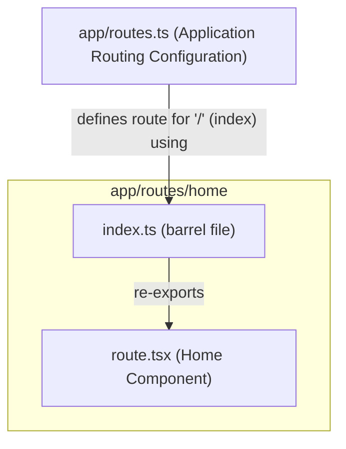

# `app/routes/home/` ディレクトリ構造と機能分析

このドキュメントは `app/routes/home/` ディレクトリ内のファイル構成、各ファイルの責務、主要な関数やコンポーネント、および関連モジュールとの依存関係をまとめたものです。

## 1. ファイル構成と主な責務

`app/routes/home/` ディレクトリは、アプリケーションのホームページ（インデックスページ）に関連する機能を集約しています。

```
app/routes/home/
├── index.ts         # route.tsx からコンポーネントをエクスポートするバレルファイル
└── route.tsx        # ホームページのReactコンポーネントを定義
```

-   **`app/routes/home/index.ts`**:
    -   **責務**: `route.tsx` からデフォルトエクスポートされた `Home` コンポーネントを再エクスポートします。これにより、他のモジュール（特に `app/routes.ts` のようなルーティング設定ファイル）からのインポートパスを簡潔にします。
    -   **概要**: `export { default } from "./route";` という一行で構成されています。
-   **`app/routes/home/route.tsx`**:
    -   **責務**: アプリケーションのホームページのUI（ユーザーインターフェース）をレンダリングします。
    -   **概要**: このファイルは、簡単な紹介文とReact Routerのドキュメントへのリンクを表示する静的なコンテンツページを定義するReactコンポーネント (`Home`) を含みます。

## 2. クラス・関数の概要と関連モジュール

### `app/routes/home/route.tsx`

-   **`Home()` (デフォルトエクスポートコンポーネント)**
    -   **概要**: ホームページのメインReactコンポーネントです。
    -   **主な機能**:
        -   "This is a demo for React Router." というテキストを表示します。
        -   React Routerの公式ドキュメントへの外部リンク (`<a href="https://reactrouter.com">the docs at reactrouter.com</a>`) を提供します。
    -   **関連モジュール**:
        -   このコンポーネントは、現在のところ外部のReact Routerコンポーネント（例: `Link`）やカスタムフックを直接インポートしていません。外部リンクは標準の `<a>` タグを使用しています。

### `app/routes/home/index.ts`

-   **デフォルトエクスポート**
    -   **概要**: `app/routes/home/route.tsx` から `Home` コンポーネントを再エクスポートします。
    -   **関連モジュール**:
        -   `./route`: `Home` コンポーネントをインポートします。

## 3. 外部連携部分とその処理の流れ

`app/routes/home/route.tsx` は主に静的コンテンツを表示するため、複雑な外部連携やデータ処理フローはありません。

-   **外部リンク**:
    -   標準的なHTMLの `<a>` タグを使用して、React Routerの公式サイトへリンクします。

このページには `loader` や `action` が定義されていないため、サーバーサイドのデータフェッチやフォーム送信といった処理は行われません。

## 4. モジュール間の依存関係

`app/routes/home/` ディレクトリ内のモジュールと、それらが依存する主要な外部モジュールとの関係を示します。



**解説:**

-   `app/routes/home/route.tsx` ( `Home` コンポーネント) は、現在のところ外部ライブラリからの直接的なインポートはありません。
-   `app/routes/home/index.ts` は `route.tsx` をエクスポートし、アプリケーション全体のルーティング設定ファイル (`app/routes.ts`) がこれをインデックスルート (`index("routes/home/index.ts")`) として参照します。
-   このページは静的なため、`app/data.ts` のようなデータ層モジュールへの依存はありません。

---

この分析は、提供されたファイルに基づいて行われました。
