# React Router v7 プロジェクト 技術構成・設計方針ドキュメント

## 1. 開発ツールとビルド環境

- **ビルドシステム:**
    - `vite.config.mts` ファイルの存在から、ビルドツールとして **Vite** が採用されていることが明確です。
- **ESLint / Prettier / Stylelint の構成と自動フォーマット戦略:**
    - `biome.json` ファイルが存在し、Biome がフォーマット (`formatter`) およびリンティング (`linter`) の役割を担っています。JavaScript と CSS の両方に対して設定が有効化されています。
    - `organizeImports.enabled: true` により、インポート文の自動整理も行われます。
    - `.editorconfig` ファイルも存在し、インデントスタイル、文字コードなどの基本的なコーディングスタイルの一貫性をエディタレベルで補助しています。
- **LintルールやCIでのコード品質維持戦略:**
    - **Lintルール:** `biome.json` に Biome の Lint ルールが設定されています。
    - **CI (Continuous Integration):** `.github/workflows/ci.yml` (GitHub Actions) が定義されています。
        - `pnpm/action-setup` を使用して pnpm をセットアップし、依存関係をインストール (`run_install: true`)。
        - 実行されるスクリプト:
            - `pnpm run test:coverage` (Vitestによるテストとカバレッジレポート)
            - `pnpm run lint` (Biomeによるリンティング)
            - `pnpm run typecheck` (TypeScriptによる型チェック)
            - `pnpm run build` (Viteによるプロダクションビルド)
        - これにより、コード品質が自動的にチェックされます。

## 2. モジュール設計とディレクトリ構成

- **`features/` or `domains/` 等のFeature-Based構造の採用有無:**
    - 明示的な `features/` や `domains/` といったトップレベルディレクトリによる Feature-Based な構造は採用されていません。
    - 代わりに、`app/routes/` ディレクトリ以下にルートごとのモジュールが配置されており、これが実質的なフィーチャー分割として機能しています (例: `app/routes/contact/`, `app/routes/edit-contact/`)。
    - `app/layouts/` はレイアウト関連のモジュールをまとめています。
- **ルーティングと画面の物理配置の関係:**
    - ルーティングパスとファイルシステムのパスは密接に対応しています。
        - 例: `/contacts/:contactId` のルートは `app/routes/contact/index.ts` (および関連ファイル) に対応します。
    - 各ルートディレクトリ内には、`route.tsx` (メインコンポーネント)、`loader.ts(x)`、`action.ts(x)`、`components/` (ルート固有コンポーネント)、`*.spec.ts(x)` (テスト) が配置される構造です。型定義は主に `react-router` から直接インポートされるか、`@react-router/dev-tools` によって生成された型が利用されます。
    - `index.ts` ファイルがバレルファイルとして機能し、ルートモジュールのエントリポイントを簡潔にしています (例: `app/routes/home/index.ts` は `app/routes/home/route.tsx` をデフォルトエクスポート)。
- **Lazy Load や Code Splitting の導入状況:**
    - Vite はデフォルトで効率的なコード分割（Code Splitting）をサポートします。
    - `app/routes.ts` でルート定義にファイルパス文字列 (例: `"routes/home/index.ts"`) を使用する方式は、`@react-router/dev` ツールチェインがルートごとのコード分割を自動的に行うことを強く示唆しています。これにより、初期ロード時のバンドルサイズが削減され、各ルートのコードは実際にそのルートが要求されたときに遅延読み込み (Lazy Load) されます。
    - `app/root/components/HydrateFallback.tsx` は、遅延読み込みコンポーネントのロード中に表示されるフォールバックUIとして機能している可能性があります。
    - `react-router.config.ts` ファイルは `@react-router/dev` の設定ファイルです。

---

### Mermaid記法によるディレクトリ構造と依存関係の概要 (推測を含む)

```mermaid
graph TD
    subgraph ProjectRoot ["プロジェクトルート"]
        direction LR
        ViteConfig["vite.config.mts"]
        TSConfig["tsconfig.json"]
        BiomeJSON["biome.json"]
        EditorConfig[".editorconfig"]
        ReactRouterConfig["react-router.config.ts"]
        PackageJSON["package.json"]
        GitHubCI[".github/workflows/ci.yml"]
    end

    subgraph AppDir ["app/"]
        direction LR
        DataTS["data.ts (データ層)"]
        RoutesTS["routes.ts (ルート定義)"]

        subgraph RootModule ["root/ (アプリケーションルート)"]
            direction TB
            RootTSX["root.tsx (アプリケーションエントリーポイント、主要コンポーネント・ロジックをエクスポート)"]
            RootAction["root/action.ts"]
            RootLoader["root/loader.ts"]
            subgraph RootComponents ["root/components/"]
                LayoutHTMLShell["Layout.tsx (HTMLシェル)"]
                ErrorBoundaryTSX["ErrorBoundary.tsx"]
                AppTSX["App.tsx (Outletのみ)"]
                HydrateFallbackTSX["HydrateFallback.tsx"]
            end
        end

        subgraph LayoutsModule ["layouts/ (共通レイアウト)"]
            direction TB
            SidebarLayout["sidebar/layout.tsx"]
            subgraph SidebarComponents ["sidebar/components/"]
                ContactNavList["ContactNavList.tsx"]
                NewContactButton["NewContactButton.tsx"]
                SearchFormComponent["SearchFormComponent.tsx"]
                SidebarHeader["SidebarHeader.tsx"]
            end
            SidebarLoader["sidebar/loader.ts (ファイルサマリーのみ)"]
        end

        subgraph RoutesModules ["routes/ (各ルート)"]
            direction TB
            HomeRoute["home/route.tsx"]
            HomeIndex["home/index.ts"]
            ContactRouteDir["contact/ (連絡先詳細)"]
            EditContactRouteDir["edit-contact/ (連絡先編集)"]
            DestroyContactRouteDir["destroy-contact/ (連絡先削除)"]
            AboutRoute["about/route.tsx (ファイルサマリーのみ)"]
        end
    end

    %% Dependencies
    ReactRouterConfig --> ViteConfig
    RoutesTS -- "defines structure for" --> RootTSX
    RootTSX -- "exports components from" --> RootComponents
    RootTSX -- "exports loader/action from" --> RootLoader
    RootTSX -- "exports loader/action from" --> RootAction

    RootComponents.AppTSX -- "is main UI entry, uses" --> LayoutsModule.SidebarLayout
    RootComponents.AppTSX -- "renders matched route via Outlet into" --> RoutesModules
    RootComponents.LayoutHTMLShell -- "wraps" --> RootComponents.AppTSX


    LayoutsModule.SidebarLayout --> SidebarComponents.ContactNavList
    LayoutsModule.SidebarLayout --> SidebarComponents.NewContactButton
    LayoutsModule.SidebarLayout --> SidebarComponents.SearchFormComponent
    LayoutsModule.SidebarLayout --> SidebarComponents.SidebarHeader
    LayoutsModule.SidebarLayout -- "uses data from" --> SidebarLoader
    SidebarLoader -- "fetches data using" --> DataTS

    RoutesModules -- "components often use data from their loaders" --> DataTS
    RoutesModules -- "loaders/actions use functions from" --> DataTS

    %% Tests
    subgraph Tests ["テスト関連 (Vitest)"]
        direction LR
        SetupTests["setupTests.ts"]
        Specs["*.spec.ts(x) (各所に配置)"]
    end

    ViteConfig -- "configures" --> Tests
    Specs -- "use Vitest & RTL, configured by" --> ViteConfig
    PackageJSON -- "defines test scripts" --> Tests
```

このドキュメントは、提供されたファイルに基づいて作成されました。詳細な実装や設定は、実際のコードを参照することでより正確に把握できます。
