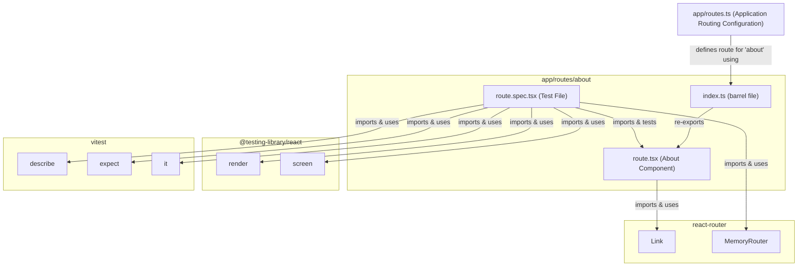

# `app/routes/about/` ディレクトリ構造と機能分析

このドキュメントは `app/routes/about/` ディレクトリ内のファイル構成、各ファイルの責務、主要な関数やコンポーネント、および関連モジュールとの依存関係をまとめたものです。

## 1. ファイル構成と主な責務

`app/routes/about/` ディレクトリは、アプリケーションの「About」ページに関連する機能を集約しています。

```
app/routes/about/
├── index.ts         # route.tsx からコンポーネントをエクスポートするバレルファイル
├── route.tsx        # "About"ページのReactコンポーネントを定義
└── route.spec.tsx   # route.tsx のテストファイル
```

-   **`app/routes/about/index.ts`**:
    -   **責務**: `route.tsx` からデフォルトエクスポートされた `About` コンポーネントを再エクスポートします。これにより、他のモジュール（特に `app/routes.ts` のようなルーティング設定ファイル）からのインポートパスを簡潔にします。
    -   **概要**: `export { default } from "./route";` という一行で構成されています。
-   **`app/routes/about/route.tsx`**:
    -   **責務**: 「About」ページのUI（ユーザーインターフェース）をレンダリングします。
    -   **概要**: このファイルは、アプリケーションの概要、機能、React Routerに関する情報などを表示する静的なコンテンツページを定義するReactコンポーネント (`About`) を含みます。
-   **`app/routes/about/route.spec.tsx`**:
    -   **責務**: `app/routes/about/route.tsx` で定義された `About` コンポーネントのユニットテスト（レンダリングテスト）を記述します。
    -   **概要**: `@testing-library/react` の `render` と `screen`、`react-router` の `MemoryRouter`、および `vitest` の `describe`, `expect`, `it` を使用して、`About` コンポーネントが期待通りにレンダリングされることを検証します。具体的には、「About React Router Contacts」というテキストが表示されることを確認しています。

## 2. クラス・関数の概要と関連モジュール

### `app/routes/about/route.tsx`

-   **`About()` (デフォルトエクスポートコンポーネント)**
    -   **概要**: 「About」ページのメインReactコンポーネントです。
    -   **主な機能**:
        -   デモアプリケーションへの戻るリンク (`<Link to="/">← Go to demo</Link>`) を表示します。
        -   アプリケーションのタイトル、説明、React Routerの機能（ローダー、アクションなど）に関する情報を表示します。
        -   React Routerの公式ドキュメントへの外部リンク (`<a href="https://reactrouter.com">reactrouter.com</a>`) を提供します。
    -   **関連モジュール**:
        -   `react-router`: `Link` コンポーネントをインポートして内部ナビゲーションに使用します。

### `app/routes/about/index.ts`

-   **デフォルトエクスポート**
    -   **概要**: `app/routes/about/route.tsx` から `About` コンポーネントを再エクスポートします。
    -   **関連モジュール**:
        -   `./route`: `About` コンポーネントをインポートします。

### `app/routes/about/route.spec.tsx`

-   **`describe("About Component", ...)`**
    -   **概要**: `About` コンポーネントのテストスイートを定義します。
    -   **`it("renders the about page content correctly", ...)`**
        -   **概要**: `About` コンポーネントが正しくレンダリングされることをテストします。
        -   **主な処理**:
            1.  `render` 関数 (`@testing-library/react`) を使用して、`About` コンポーネントを `MemoryRouter` (`react-router`) でラップしてレンダリングします。
            2.  `screen.getByText` (`@testing-library/react`) を使用して、特定のテキスト ("About React Router Contacts") がドキュメント内に存在することを `expect` (`vitest`) を用いて検証します。
    -   **関連モジュール**:
        -   `@testing-library/react`: `render`, `screen` をインポートします。
        -   `react-router`: `MemoryRouter` をインポートします。
        -   `vitest`: `describe`, `expect`, `it` をインポートします。
        -   `./route`: テスト対象の `About` コンポーネントをインポートします。

## 3. 外部連携部分とその処理の流れ

`app/routes/about/route.tsx` は主に静的コンテンツを表示するため、複雑な外部連携やデータ処理フローはありません。

-   **内部ナビゲーション**:
    -   `react-router` の `Link` コンポーネントを使用して、ホームページ (`/`) へのナビゲーションを提供します。
-   **外部リンク**:
    -   標準的なHTMLの `<a>` タグを使用して、React Routerの公式サイトへリンクします。

このページには `loader` や `action` が定義されていないため、サーバーサイドのデータフェッチやフォーム送信といった処理は行われません。

## 4. モジュール間の依存関係

`app/routes/about/` ディレクトリ内のモジュールと、それらが依存する主要な外部モジュール（主にReact Routerとテストライブラリ）の関係を示します。



**解説:**

-   `app/routes/about/route.tsx` ( `About` コンポーネント) は `react-router` から `Link` コンポーネントをインポートして使用します。
-   `app/routes/about/index.ts` は `route.tsx` をエクスポートします。
-   `app/routes.ts` (アプリケーションルーティング設定) は `app/routes/about/index.ts` をインポートし、`/about` パスに対するルートとして設定しています (`route("about", "routes/about/index.ts")`)。
-   `app/routes/about/route.spec.tsx` は `route.tsx` の `About` コンポーネントをテスト対象とし、`react-router` から `MemoryRouter`、`@testing-library/react` から `render` と `screen`、`vitest` からテストユーティリティをインポートして使用します。
-   このページは静的なため、`app/data.ts` のようなデータ層モジュールへの依存はありません。

---

この分析は、提供されたファイルに基づいて行われました。
