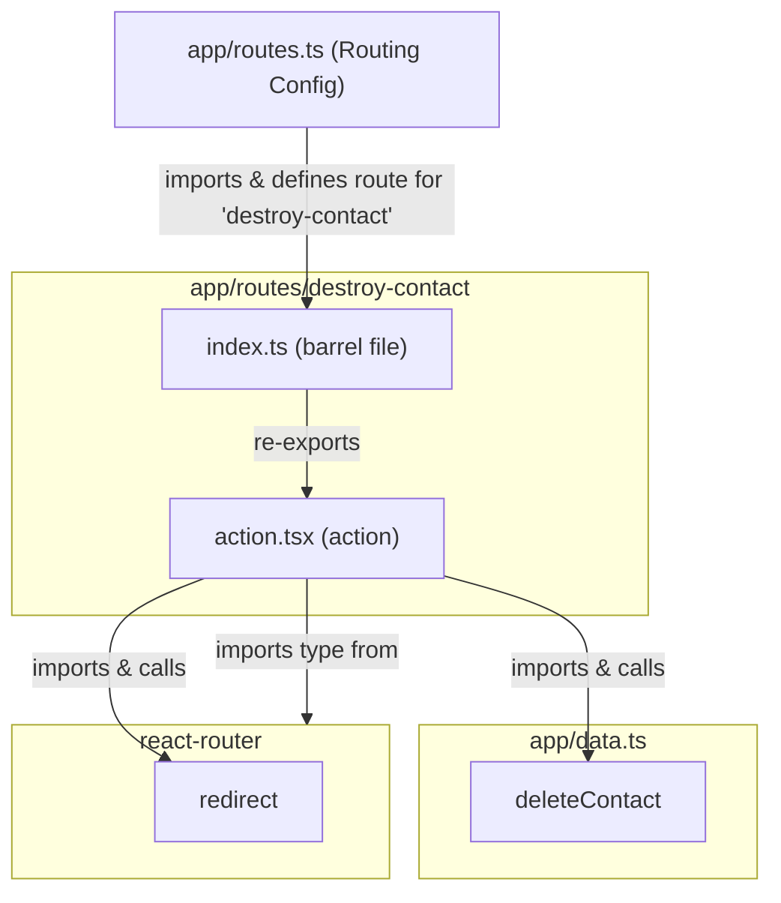

# `app/routes/destroy-contact/` ディレクトリ構造と機能分析

このドキュメントは `app/routes/destroy-contact/` ディレクトリ内のファイル構成、各ファイルの責務、主要な関数やコンポーネント、および関連モジュールとの依存関係をまとめたものです。

## 1. ファイル構成と主な責務

`app/routes/destroy-contact/` ディレクトリは、特定の連絡先を削除するアクションに関連する機能を集約しています。このルートは通常、UIコンポーネント (`route.tsx`) やデータローダー (`loader.tsx`) を持ちません。なぜなら、このルートの主な目的はデータミューテーション（削除）を実行し、その後リダイレクトすることだからです。

```
app/routes/destroy-contact/
├── action.tsx       # 連絡先を削除するアクションを定義
└── index.ts         # action.tsx から action 関数をエクスポートするバレルファイル
```

-   **`app/routes/destroy-contact/action.tsx`**:
    -   **責務**: 特定の連絡先を削除する `action` 関数を定義します。ルートパラメータ (`params.contactId`) を使用してデータ層の `deleteContact` 関数を呼び出し、処理後にホームページ (`/`) へリダイレクトします。
-   **`app/routes/destroy-contact/index.ts`**:
    -   **責務**: `action.tsx` から `action` 関数を再エクスポートします。これにより、`app/routes.ts` からのインポートを簡潔にします。
    -   **概要**: `export { action } from "./action";` という一行で構成されています。

## 2. クラス・関数の概要と関連モジュール

### `app/routes/destroy-contact/action.tsx`

-   **`action({ params }: Route.ActionArgs)`**
    -   **概要**: 特定の連絡先を削除し、ホームページにリダイレクトします。
    -   **主な処理**:
        1.  `params.contactId` を取得します。
        2.  `deleteContact(params.contactId)` (from `../../data`) を呼び出し、連絡先データを非同期に削除します。
        3.  `redirect("/")` (from `react-router`) を呼び出し、ユーザーをホームページへリダイレクトします。
    -   **関連モジュール**:
        -   `react-router`: `redirect` 関数および `Route.ActionArgs` 型をインポートします。
        -   `../../data`: `deleteContact` 関数をインポートします。

### `app/routes/destroy-contact/index.ts`

-   **エクスポート**:
    -   `action` from `"./action"`
    -   **関連モジュール**:
        -   `./action`

## 3. 外部連携部分とその処理の流れ

### 連絡先削除フロー (Action)

1.  ユーザーが連絡先詳細ページ (`/contacts/:contactId`) の「削除」ボタンをクリックし、確認ダイアログで「OK」を選択します。
2.  `app/routes/contact/components/ContactActions.tsx` 内のフォームが `/contacts/:contactId/destroy` にPOSTリクエストを送信します。
3.  `app/routes.ts` のルーティング設定 (`route("contacts/:contactId/destroy", "routes/destroy-contact/index.ts")`) に基づき、`app/routes/destroy-contact/action.tsx` の `action` 関数が呼び出されます。
4.  `action` 関数は `params.contactId` を取得します。
5.  `action` 関数は `app/data.ts` の `deleteContact(contactId)` を呼び出し、データストアから該当する連絡先を削除します。
6.  処理完了後、`action` 関数は `redirect("/")` を返し、ユーザーはホームページにリダイレクトされます。

## 4. モジュール間の依存関係



**解説:**

-   **`index.ts`**: `action.tsx` から `action` 関数をエクスポートし、`app/routes.ts` がこれを参照してルーティングを定義します。
-   **`action.tsx`**:
    -   `app/data.ts` の `deleteContact` を呼び出してデータを削除します。
    -   `react-router` の `redirect` を呼び出してページ遷移を行います。

---

この分析は、提供されたファイルに基づいて行われました。
