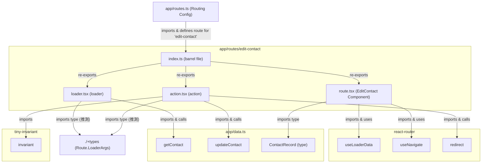

# `app/routes/edit-contact/` ディレクトリ構造と機能分析

このドキュメントは `app/routes/edit-contact/` ディレクトリ内のファイル構成、各ファイルの責務、主要な関数やコンポーネント、および関連モジュールとの依存関係をまとめたものです。

## 1. ファイル構成と主な責務

`app/routes/edit-contact/` ディレクトリは、既存の連絡先情報を編集するページに関連する機能を集約しています。

```
app/routes/edit-contact/
├── action.tsx       # 連絡先情報を更新するアクションを定義
├── index.ts         # route, loader, action をエクスポートするバレルファイル
├── loader.tsx       # 編集対象の連絡先データを取得するローダーを定義
└── route.tsx        # 連絡先編集フォームのReactコンポーネントを定義
```

-   **`app/routes/edit-contact/action.tsx`**:
    -   **責務**: 連絡先情報を更新する `action` 関数を定義します。フォームデータから更新内容を取得し、データ層の `updateContact` 関数を呼び出します。処理後、該当の連絡先詳細ページにリダイレクトします。
-   **`app/routes/edit-contact/index.ts`**:
    -   **責務**: `route.tsx` からデフォルトエクスポートされた `EditContact` コンポーネント、`loader.tsx` から `loader` 関数、`action.tsx` から `action` 関数を再エクスポートします。これにより、`app/routes.ts` からのインポートを簡潔にします。
-   **`app/routes/edit-contact/loader.tsx`**:
    -   **責務**: 編集対象の連絡先の現在のデータを取得する `loader` 関数を定義します。ルートパラメータ (`params.contactId`) を使用してデータ層の `getContact` 関数を呼び出します。連絡先が見つからない場合は404エラーをスローします。
-   **`app/routes/edit-contact/route.tsx`**:
    -   **責務**: 連絡先情報を編集するためのフォームUIをレンダリングします。`useLoaderData` を使用して `loader` から連絡先データを取得し、フォームの初期値として設定します。キャンセルボタンで前のページに戻る機能も提供します。

## 2. クラス・関数の概要と関連モジュール

### `app/routes/edit-contact/action.tsx`

-   **`action({ params, request }: Route.ActionArgs)`**
    -   **概要**: 連絡先の情報を更新し、連絡先詳細ページにリダイレクトします。
    -   **主な処理**:
        1.  `params.contactId` が存在することを `invariant` で表明します。
        2.  `request.formData()` からフォームデータを取得します。
        3.  `Object.fromEntries(formData)` を使用してフォームデータをオブジェクトに変換します。
        4.  `updateContact(params.contactId, updates)` (from `../../data`) を呼び出し、連絡先データを更新します。
        5.  `redirect(\`/contacts/\${params.contactId}\`)` (from `react-router`) を呼び出し、更新された連絡先の詳細ページへリダイレクトします。
    -   **関連モジュール**:
        -   `react-router`: `redirect` 関数をインポートします。
        -   `tiny-invariant`: `invariant` 関数をインポートします。
        -   `../../data`: `updateContact` 関数をインポートします。
        -   `./+types`: `Route.ActionArgs` 型をインポートします (推測)。

### `app/routes/edit-contact/index.ts`

-   **エクスポート**:
    -   `default` from `"./route"` (EditContactコンポーネント)
    -   `loader` from `"./loader"`
    -   `action` from `"./action"`
    -   **関連モジュール**:
        -   `./route`, `./loader`, `./action`

### `app/routes/edit-contact/loader.tsx`

-   **`loader({ params }: Route.LoaderArgs)`**
    -   **概要**: 編集対象の連絡先のデータを取得します。
    -   **主な処理**:
        1.  `params.contactId` を使用して `getContact` (from `../../data`) を呼び出します。
        2.  連絡先データが存在しない場合、`Response("Not Found", { status: 404 })` をスローします。
        3.  取得した連絡先データを `{ contact }` オブジェクトとして返します。
    -   **関連モジュール**:
        -   `../../data`: `getContact` 関数をインポートします。
        -   `./+types`: `Route.LoaderArgs` 型をインポートします (推測)。

### `app/routes/edit-contact/route.tsx` (EditContactコンポーネント)

-   **`EditContact()` (デフォルトエクスポートコンポーネント)**
    -   **概要**: 連絡先編集フォームのUIコンポーネント。
    -   **主な機能**:
        -   `useLoaderData()` を使用して `loader` から連絡先データを取得します。
        -   取得した連絡先データを各フォーム入力フィールド (`<input>`, `<textarea>`) の `defaultValue` として設定します。
        -   フォーム (`<form method="post">`) は、送信時に現在のルートの `action` 関数を呼び出します。
        -   「キャンセル」ボタンは `useNavigate()` フックを使用して、前のページ (`navigate(-1)`) に戻ります。
    -   **関連モジュール**:
        -   `react-router`: `useLoaderData`, `useNavigate` フックをインポートします。
        -   `../../data`: `ContactRecord` 型をインポートします。

## 3. 外部連携部分とその処理の流れ

### データ取得フロー (Loader)

1.  ユーザーが `/contacts/:contactId/edit` にアクセスします。
2.  `app/routes.ts` のルーティング設定に基づき、`app/routes/edit-contact/loader.tsx` の `loader` 関数が呼び出されます。
3.  `loader` 関数は `params.contactId` を取得します。
4.  `loader` 関数は `app/data.ts` の `getContact(contactId)` を呼び出し、連絡先データを非同期に取得します。
5.  連絡先が見つからない場合、404 `Response` がスローされ、エラー境界 (例: `app/root/components/ErrorBoundary.tsx`) によって処理されます。
6.  取得した連絡先データは `{ contact }` という形式で `app/routes/edit-contact/route.tsx` の `EditContact` コンポーネントに渡されます。
7.  `EditContact` コンポーネントは `useLoaderData()` でデータを受け取り、フォームの初期値としてUIをレンダリングします。

### 連絡先更新フロー (Action)

1.  ユーザーが編集フォームに必要な変更を加え、「保存」ボタンをクリックします。
2.  `EditContact` コンポーネント内の `<form method="post">` が現在のルート (`/contacts/:contactId/edit`) にPOSTリクエストを送信します。フォームデータには更新された連絡先情報が含まれます。
3.  `app/routes.ts` のルーティング設定に基づき、`app/routes/edit-contact/action.tsx` の `action` 関数が呼び出されます。
4.  `action` 関数は `request.formData()` でフォームデータを取得し、`Object.fromEntries` でオブジェクトに変換します。
5.  `action` 関数は `params.contactId` と更新されたデータを使って `app/data.ts` の `updateContact()` を呼び出し、データストア内の連絡先情報を更新します。
6.  処理完了後、`action` 関数は `redirect(\`/contacts/\${params.contactId}\`)` を返し、ユーザーは更新された連絡先の詳細ページにリダイレクトされます。

## 4. モジュール間の依存関係



**解説:**

-   **`index.ts`**: `route.tsx`, `loader.tsx`, `action.tsx` からそれぞれの主要なエクスポートをまとめ、`app/routes.ts` がこれを参照してルーティングを定義します。
-   **`loader.tsx`**: `app/data.ts` の `getContact` を呼び出してデータを取得し、フォームの初期表示に使用します。データが見つからない場合は404エラーをスローします。
-   **`action.tsx`**: `app/data.ts` の `updateContact` を呼び出してデータを更新し、`react-router` の `redirect` を使用して連絡先詳細ページに遷移します。`tiny-invariant` を使用して `contactId` の存在を検証します。
-   **`route.tsx`**: `loader` からデータを取得 (`useLoaderData`) し、編集フォームを表示します。`useNavigate` を使用してキャンセル時のページ遷移を処理します。
-   型定義ファイル (`./+types`) が `loader.tsx` と `action.tsx` で使用されていると推測されますが、チャットには追加されていません。

---

この分析は、提供されたファイルに基づいて行われました。
