# React Router v7 プロジェクト 技術構成・設計方針ドキュメント

## 1. ルーティングと画面構造の実装方針

- **ルーティング構文:**
    - ルート設定は `app/routes.ts` に集約されており、`@react-router/dev/routes` からインポートされた `layout`, `index`, `route` ヘルパー関数を使用して宣言的に定義されています。
    - 例: `layout("layouts/sidebar/index.ts", [ index("routes/home/index.ts"), ... ])`
    - これはJSXベースの `<Routes>` や `<Route>` を直接記述するのではなく、`@react-router/dev` のツールチェインがこの設定を解釈してルーティングを構築します。
    - アプリケーションのエントリーポイント (`app/root.tsx` からエクスポートされる `App` コンポーネント内 (`app/root/components/App.tsx`)) で `<Outlet />` が使用され、マッチしたルートコンポーネントが描画されます。
    - `createBrowserRouter` の直接的な記述は見られませんが、React Router v6.4+ の標準であり、`@react-router/dev` によって内部的に利用されていると推測されます。
- **レイアウトコンポーネントの分離方針:**
    - `app/root/components/Layout.tsx`: アプリケーション全体の基本的なHTML構造（`<html>`, `<head>`, `<body>`、スタイルシートリンク、スクリプトタグ）を提供します。
    - `app/layouts/sidebar/layout.tsx`: サイドバー (`#sidebar`) とメインコンテンツエリア (`#detail` 内の `<Outlet />`) を持つ主要なレイアウトコンポーネントとして機能します。
    - これらにより、全体レイアウトと特定領域（例: サイドバーを持つページ群）のレイアウトが明確に分離されています。
- **Nested Routes / Dynamic Routes / Error Boundary の使用傾向:**
    - **Nested Routes:**
        - `app/routes.ts` で `layout()` ヘルパー関数が使用されており、ネストされたルート構造を定義しています。
        - `app/layouts/sidebar/layout.tsx` や `app/root/components/App.tsx` で `<Outlet />` が使用され、子ルートのコンポーネントが描画されます。
    - **Dynamic Routes:**
        - `app/routes.ts` で `contacts/:contactId` のような動的セグメントを持つパスが定義されています。
        - `loader` や `action` 内で `params.contactId` としてアクセスされています (例: `app/routes/contact/loader.tsx`, `app/routes/edit-contact/loader.tsx`)。
    - **Error Boundary:**
        - `app/root.tsx` が `./root/components/ErrorBoundary` から `ErrorBoundary` をエクスポートし、これがルートレベルのエラーハンドリングに使用されます。
        - `app/root/components/ErrorBoundary.tsx` は `isRouteErrorResponse` を利用して、React Router がスローするエラーレスポンス (例: 404) と一般的な JavaScript エラーを区別して処理します。
- **画面遷移の設計思想:**
    - SPA (Single Page Application) として構築されています。
    - データ取得には `loader` 関数を積極的に活用しています (例: `app/layouts/sidebar/loader.ts` (ファイルサマリーのみ), `app/routes/contact/loader.tsx`, `app/root/loader.ts`)。これらは `app/routes.ts` で各ルートに紐付けられています。
    - データ更新処理（作成、更新、削除）には `action` 関数を活用しています (例: `app/root/action.ts`, `app/routes/contact/action.tsx`, `app/routes/destroy-contact/action.tsx`)。これらも `app/routes.ts` で紐付けられています。
    - `action` 関数内で `redirect` (from `react-router`) を使用して、処理後の画面遷移を制御しています (例: `app/root/action.ts` で `/contacts/${contact.id}/edit` へリダイレクト)。

## 2. 状態管理戦略

- **使用されている状態管理ライブラリ:**
    - Redux、Zustand、Jotai といった専用の状態管理ライブラリの明示的な使用は確認されません。
    - React の組み込みフック (`useState`, `useEffect`) がコンポーネントローカルな状態管理に利用されています (例: `app/layouts/sidebar/layout.tsx` の `query` state)。
    - React Context API の広範なカスタム利用は見受けられません。
- **状態のスコープ設計と型付けの戦略:**
    - **スコープ:**
        - 主にコンポーネントローカルな状態 (`useState`)。
        - ルート間で共有されるデータは、React Router の `loader` を介して取得され、`useLoaderData` でコンポーネントに渡される設計が中心です。これは事実上、ルートスコープの状態として機能します。
    - **型付け:**
        - プロジェクト全体で TypeScript (`strict: true` が `tsconfig.json` で有効) が採用されており、状態やデータ構造には型定義が付与されています。
        - `app/data.ts` で `ContactMutation`, `ContactRecord` といった型が定義され、データの一貫性を担保しています。
        - 各ルートの `loader`/`action` の型定義は、`./+types` (例: `app/routes/contact/+types`) からインポートされる `Route.LoaderArgs`, `Route.ActionArgs` を使用しており、これは `@react-router/dev` ツールによって生成される型と推測されます。
        - Zod や io-ts のようなランタイムバリデーションを兼ねたスキーマライブラリの積極的な使用は確認できません。
- **URLパラメータ・Loaderによるデータフェッチとの役割分担:**
    - URLパスパラメータ (例: `params.contactId` in `app/routes/contact/loader.tsx`) やURL検索パラメータ (例: `url.searchParams.get("q")` in `app/layouts/sidebar/layout.tsx` (loader経由)) は、特定のデータリソースを識別したり、フィルタリング条件を指定したりするために使用されます。
    - `loader` 関数はこれらのURLパラメータやリクエスト情報 (`request` オブジェクト) を受け取り、対応するデータを非同期に取得する責務を持ちます。
    - このように、URLが状態の主要な情報源となり、`loader` がその状態に基づいてデータを準備するという明確な役割分担がなされています。

## 3. API連携・副作用管理

- **fetch / axios などの利用方針と分離構造:**
    - `app/data.ts` がデータ操作層（APIクライアント層に相当）として機能し、データ取得・作成・更新・削除のロジックをカプセル化しています (例: `getContacts`, `createEmptyContact`, `updateContact`, `deleteContact`)。
    - 現在の実装 (`fakeContacts`) はインメモリのモックデータを使用していますが、実際のAPI連携を行う場合、このモジュール内で `fetch` や `axios` が使用される設計になっていると推測されます。
    - API呼び出しロジックはUIコンポーネントから分離されています。
- **React Router の `loader` / `action` による副作用の設計戦略:**
    - **`loader`**: ルートがレンダリングされる前のデータ取得（読み取り系の副作用）を担当します。これにより、コンポーネントはデータが準備された状態でマウントされます。
    - **`action`**: フォーム送信などによるデータ変更（書き込み系の副作用）を担当します。データの作成、更新、削除処理を行い、必要に応じて `redirect` で画面遷移をトリガーします。
    - この設計により、副作用のロジックがコンポーネントから分離され、宣言的なデータフローが実現されています。
- **エラーハンドリング・バリデーションの共通化戦略:**
    - **エラーハンドリング:**
        - ルートレベルのエラーは `app/root/components/ErrorBoundary.tsx` で捕捉されます。
        - `loader` や `action` 内でエラーが発生した場合、`throw new Response(...)` や `throw new Error(...)` を用いてエラーを通知し、`ErrorBoundary` で処理されます (例: `app/routes/edit-contact/loader.tsx` で404エラー)。
        - `invariant` ユーティリティ (`app/data.ts`, `app/routes/edit-contact/action.tsx`) がアサーション（事前条件チェック）のために使用されています。
    - **バリデーション:**
        - フォームデータのバリデーションに関する具体的なライブラリ (Zod, Yup など) の使用は明示されていません。
        - `action` 関数内で `request.formData()` を使用してフォームデータを取得し (`app/routes/contact/action.tsx`, `app/routes/edit-contact/action.tsx`)、`Object.fromEntries(formData)` でオブジェクトに変換後、`updateContact` のような関数に渡しています。この過程で手動のバリデーションが行われている可能性がありますが、詳細は不明です。
        - TypeScript の型 (`ContactMutation`) がデータの形状を定義し、コンパイル時の型チェックに貢献しています。

## 4. テスト方針と使用ライブラリ

- **テストフレームワーク:**
    - **Vitest**: `vite.config.mts` の `test` 設定、およびテストファイル (`*.spec.tsx`) 内での `vi.mock`, `vi.fn`, `describe`, `it`, `expect` の使用から、テストランナーおよびアサーションライブラリとして Vitest が採用されています。
    - **React Testing Library**: `render`, `screen` などのユーティリティが `@testing-library/react` からインポートされ、コンポーネントのテストに使用されています。
    - `setupTests.ts` で `@testing-library/jest-dom` がインポートされており、DOM要素に対するカスタムマッチャー (例: `toBeInTheDocument()`) が利用可能です。
- **テスト構成と命名規則:**
    - **構成:**
        - 主にユニットテストとインテグレーションテストが記述されています。コンポーネント (`*.spec.tsx`) や `loader`/`action` (`*.spec.ts` または `*.spec.tsx`) ごとにテストファイルが配置されています。
        - `vite.config.mts` の `coverage.exclude` 設定から、テストカバレッジも計測されていることがわかります。
        - E2Eテストの存在は確認できません。
    - **命名規則:**
        - テストファイルは `[moduleName].spec.ts` または `[moduleName].spec.tsx` という命名規則に従っています (例: `app/layouts/sidebar/layout.spec.tsx`)。
    - **Mockの取り扱い:**
        - **Vitest のモック機能**:
            - `vi.mock()`: モジュールのモック化に使用されます (例: `app/routes/contact/components/ContactHeader.spec.tsx` で `./Favorite` をモック)。`vi.hoisted()` を使ってモック定義をファイルの先頭に巻き上げることもあります (`app/layouts/sidebar/layout.spec.tsx`)。
            - `vi.fn()`: 関数のスパイやスタブを作成するために使用されます。
        - **React Router のフックのモック**: `useLoaderData`, `useNavigation`, `useSubmit` といった React Router のフックがテスト内でモックされています (`app/layouts/sidebar/layout.spec.tsx`)。
        - データ層のモック: `app/data.ts` の `fakeContacts` は、開発時やテスト時に実際のAPIを叩かずに済むようにするためのモックデータソースとして機能しています。
        - MSW (Mock Service Worker) のようなAPIレベルでのモッキングライブラリの使用は確認できません。

## 5. 型システムとスキーマ設計

- **TypeScript使用の範囲:**
    - プロジェクト内のほぼ全てのコード (`.ts`, `.tsx` ファイル) で TypeScript が使用されています。
    - `tsconfig.json` が存在し、コンパイラオプションとして `strict: true`, `noEmit: true`, `esModuleInterop: true`, `moduleResolution: "bundler"` などが設定されています。
    - `rootDirs` に `"."` と `"./.react-router/types"` が含まれており、`@react-router/dev` によって生成される型定義も参照していることが示唆されます。
    - 型注釈は広範囲に行われています。
- **バリデーションスキーマ:**
    - Zod, Yup, io-ts といったランタイムバリデーションスキーマライブラリの明示的な使用は確認できません。
    - `app/data.ts` で定義されている `ContactMutation` や `ContactRecord` のような TypeScript の型定義が、データの構造を定義し、開発時の型チェックやエディタの補完機能を通じてデータの整合性維持に寄与しています。
    - `invariant` が事前条件のチェックに使用されていますが、これは本格的なバリデーションとは異なります。
- **APIと型の整合性確保方法:**
    - `app/data.ts` で定義された型 (`ContactRecord`, `ContactMutation`) が、API（現在はモックされている `fakeContacts`）とのデータ構造の契約として機能しています。
    - `@react-router/dev` が生成する型 (`./+types` 経由で参照) が、`loader` や `action` の引数・返り値の型安全性を高めています。
    - OpenAPI や GraphQL Code Generator のようなツールを用いた型生成やスキーマ連携の仕組みは確認できません。現状では手動で型を定義し、一部をツール生成に頼っている構成と推測されます。

## 6. UI設計とコンポーネント体系

- **UIライブラリ:**
    - `app/app.css` ファイルが存在し、プロジェクト全体の基本的なスタイリングを提供しています。特定のセレクタ (例: `#sidebar`, `#contact-form`) に基づいたスタイル定義が多数見られます。
    - `app/root/components/Layout.tsx` で `appStylesHref from "../../app.css?url"` としてインポートされ、`<link rel="stylesheet" href={appStylesHref} />` で読み込まれています。
    - Tailwind CSS, Material UI, Chakra UI といった主要なUIライブラリやフレームワークの導入は確認できません。自前のCSSによるスタイリングが中心です。
    - CSS Modules の使用は `biome.json` の `css.parser.cssModules: true` 設定から示唆されますが、`app/app.css` の内容からはグローバルCSSとしての使用が主に見えます。コンポーネント単位のCSS Modulesファイルは提供されていません。
- **再利用コンポーネントの命名・配置方針:**
    - コンポーネントは機能や関連するルート・レイアウトごとにグループ化されて配置されています。
        - `app/root/components/`: アプリケーション全体に関わるコンポーネント (例: `Layout.tsx`, `ErrorBoundary.tsx`, `App.tsx`)。
        - `app/layouts/sidebar/components/`: サイドバーレイアウト固有のコンポーネント (例: `ContactNavList.tsx`, `NewContactButton.tsx`, `SearchFormComponent.tsx`, `SidebarHeader.tsx`)。
        - `app/routes/contact/components/`: 特定のルート（連絡先詳細ページ）に特化したコンポーネント (例: `ContactAvatar.tsx`, `ContactActions.tsx`, `Favorite.tsx`, `ContactHeader.tsx`)。
    - `shared/` や `ui/` といった汎用的なUIコンポーネントを格納するトップレベルディレクトリの存在は確認できません。
    - 命名はパスカルケース (`ContactAvatar`) が採用されています。
- **アトミックデザインやコンポーネント設計指針の有無:**
    - アトミックデザインのような厳格な設計指針の採用は明示されていません。
    - しかし、UIを比較的小さな関心事に分割してコンポーネント化する傾向（コンポジション指向）が観察されます。例えば、`ContactAvatar`, `ContactHeader`, `ContactNotes` (ファイルサマリーのみ), `ContactTwitter` (ファイルサマリーのみ) は連絡先詳細ページ (`app/routes/contact/route.tsx`) で組み合わせて使用されます。同様に、`NewContactButton` (`app/layouts/sidebar/components/NewContactButton.tsx`) や `SearchFormComponent` (`app/layouts/sidebar/components/SearchFormComponent.tsx`) はサイドバーレイアウト内で特定の機能（新規作成フォームの起動、検索フォームの表示・操作）を提供し、`ContactActions` (`app/routes/contact/components/ContactActions.tsx`) は連絡先に対する編集・削除操作のフォームをカプセル化しています。これらのコンポーネントは、多くの場合、React Router の `<Form>` コンポーネントをラップし、特定のユーザーインタラクションとそれに関連する `action` や `loader` の再読み込みをトリガーする役割を担います。

## 7. 開発ツールとビルド環境

- **ビルドシステム:**
    - `vite.config.mts` ファイルの存在から、ビルドツールとして **Vite** が採用されていることが明確です。
- **ESLint / Prettier / Stylelint の構成と自動フォーマット戦略:**
    - `biome.json` ファイルが存在し、Biome がフォーマット (`formatter`) およびリンティング (`linter`) の役割を担っています。JavaScript と CSS の両方に対して設定が有効化されています。
    - `organizeImports.enabled: true` により、インポート文の自動整理も行われます。
    - `.editorconfig` ファイルも存在し、インデントスタイル、文字コードなどの基本的なコーディングスタイルの一貫性をエディタレベルで補助しています。
- **LintルールやCIでのコード品質維持戦略:**
    - **Lintルール:** `biome.json` に Biome の Lint ルールが設定されています。
    - **CI (Continuous Integration):** `.github/workflows/ci.yml` (GitHub Actions) が定義されています。
        - `pnpm/action-setup` を使用して pnpm をセットアップし、依存関係をインストール (`run_install: true`)。
        - 実行されるスクリプト:
            - `pnpm run test:coverage` (Vitestによるテストとカバレッジレポート)
            - `pnpm run lint` (Biomeによるリンティング)
            - `pnpm run typecheck` (TypeScriptによる型チェック)
            - `pnpm run build` (Viteによるプロダクションビルド)
        - これにより、コード品質が自動的にチェックされます。

## 8. モジュール設計とディレクトリ構成

- **`features/` or `domains/` 等のFeature-Based構造の採用有無:**
    - 明示的な `features/` や `domains/` といったトップレベルディレクトリによる Feature-Based な構造は採用されていません。
    - 代わりに、`app/routes/` ディレクトリ以下にルートごとのモジュールが配置されており、これが実質的なフィーチャー分割として機能しています (例: `app/routes/contact/`, `app/routes/edit-contact/`)。
    - `app/layouts/` はレイアウト関連のモジュールをまとめています。
- **ルーティングと画面の物理配置の関係:**
    - ルーティングパスとファイルシステムのパスは密接に対応しています。
        - 例: `/contacts/:contactId` のルートは `app/routes/contact/index.ts` (および関連ファイル) に対応します。
    - 各ルートディレクトリ内には、`route.tsx` (メインコンポーネント)、`loader.ts(x)`、`action.ts(x)`、`components/` (ルート固有コンポーネント)、`*.spec.ts(x)` (テスト)、そして `@react-router/dev` が生成する型定義のための `+types` ディレクトリ (またはその参照) が配置される構造です。
    - `index.ts` ファイルがバレルファイルとして機能し、ルートモジュールのエントリポイントを簡潔にしています (例: `app/routes/home/index.ts` は `app/routes/home/route.tsx` をデフォルトエクスポート)。
- **Lazy Load や Code Splitting の導入状況:**
    - Vite はデフォルトで効率的なコード分割（Code Splitting）をサポートします。
    - `app/routes.ts` でルート定義にファイルパス文字列 (例: `"routes/home/index.ts"`) を使用する方式は、`@react-router/dev` ツールチェインがルートごとのコード分割を自動的に行うことを強く示唆しています。これにより、初期ロード時のバンドルサイズが削減され、各ルートのコードは実際にそのルートが要求されたときに遅延読み込み (Lazy Load) されます。
    - `app/root/components/HydrateFallback.tsx` は、SSR時のハイドレーション中や、遅延読み込みコンポーネントのロード中に表示されるフォールバックUIとして機能している可能性があります。
    - `react-router.config.ts` ファイルは `@react-router/dev` の設定ファイルであり、`ssr: true` や `prerender` といったオプションが含まれていますが、これはクライアントサイドの遅延読み込み設定とは直接関連しません。

## 9. メタ情報とSEO

- **`<Meta>` や `<head>` の動的制御戦略:**
    - `app/root/components/Layout.tsx` 内で静的な `<head>` タグと基本的な `<meta>` タグ (charset, viewport)、およびアプリケーション全体のスタイルシート (`app.css`) へのリンクが設定されています。
    - `react-helmet-async` のようなライブラリや、React Router v6.4+ の `handle` オブジェクトと `useMatches` を使ったルートごとの動的な `<title>` や `<meta>` タグの管理戦略は、提供されたファイルからは確認できません。
    - 各ルートに応じた動的なメタ情報設定の仕組みは明示されていません。
- **SSR / SSG 対応の有無:**
    - `react-router.config.ts` に `ssr: true` の設定があることから、SSR (Server-Side Rendering) が有効化されていることが明確です。
    - `app/root/components/HydrateFallback.tsx` は、SSRされたコンテンツがクライアントでハイドレーションされるまでの間、または遅延読み込みコンポーネントのロード中に表示されるフォールバックUIとして機能します。
    - `react-router.config.ts` に `prerender: ["/about"]` の設定があることから、`/about` ルートはビルド時にSSG (Static Site Generation) / 事前レンダリングの対象となっていることが示唆されます。
    - Vite は SSR をサポートしており、`@react-router/dev` ツールが Vite と連携して SSR/SSG を実現していると考えられます。

---

### Mermaid記法によるディレクトリ構造と依存関係の概要 (推測を含む)

```mermaid
graph TD
    subgraph ProjectRoot ["プロジェクトルート"]
        direction LR
        ViteConfig["vite.config.mts"]
        TSConfig["tsconfig.json"]
        BiomeJSON["biome.json"]
        EditorConfig[".editorconfig"]
        ReactRouterConfig["react-router.config.ts"]
        PackageJSON["package.json (推測)"]
        GitHubCI[".github/workflows/ci.yml"]
    end

    subgraph AppDir ["app/"]
        direction LR
        AppCSS["app.css"]
        DataTS["data.ts (データ層)"]
        RoutesTS["routes.ts (ルート定義)"]

        subgraph RootModule ["root/ (アプリケーションルート)"]
            direction TB
            RootTSX["root.tsx (エントリーポイント: loader, action, App, Layout, ErrorBoundary, HydrateFallback をエクスポート)"]
            RootAction["root/action.ts"]
            RootLoader["root/loader.ts"]
            subgraph RootComponents ["root/components/"]
                LayoutHTMLShell["Layout.tsx (HTMLシェル)"]
                ErrorBoundaryTSX["ErrorBoundary.tsx"]
                AppTSX["App.tsx (Outletのみ)"]
                HydrateFallbackTSX["HydrateFallback.tsx"]
            end
        end

        subgraph LayoutsModule ["layouts/ (共通レイアウト)"]
            direction TB
            SidebarLayout["sidebar/layout.tsx"]
            subgraph SidebarComponents ["sidebar/components/"]
                ContactNavList["ContactNavList.tsx"]
                NewContactButton["NewContactButton.tsx"]
                SearchFormComponent["SearchFormComponent.tsx"]
                SidebarHeader["SidebarHeader.tsx"]
            end
            SidebarLoader["sidebar/loader.ts (ファイルサマリーのみ)"]
        end

        subgraph RoutesModules ["routes/ (各ルート)"]
            direction TB
            HomeRoute["home/route.tsx"]
            HomeIndex["home/index.ts"]
            ContactRouteDir["contact/ (連絡先詳細)"]
            EditContactRouteDir["edit-contact/ (連絡先編集)"]
            DestroyContactRouteDir["destroy-contact/ (連絡先削除)"]
            AboutRoute["about/route.tsx (ファイルサマリーのみ)"]
        end
    end

    %% Dependencies
    ReactRouterConfig --> ViteConfig
    RoutesTS -- "defines structure for" --> RootTSX
    RootTSX -- "exports components from" --> RootComponents
    RootTSX -- "exports loader/action from" --> RootLoader
    RootTSX -- "exports loader/action from" --> RootAction

    RootComponents.AppTSX -- "is main UI entry, uses" --> LayoutsModule.SidebarLayout
    RootComponents.AppTSX -- "renders matched route via Outlet into" --> RoutesModules
    RootComponents.LayoutHTMLShell -- "wraps" --> RootComponents.AppTSX


    LayoutsModule.SidebarLayout --> SidebarComponents.ContactNavList
    LayoutsModule.SidebarLayout --> SidebarComponents.NewContactButton
    LayoutsModule.SidebarLayout --> SidebarComponents.SearchFormComponent
    LayoutsModule.SidebarLayout --> SidebarComponents.SidebarHeader
    LayoutsModule.SidebarLayout -- "uses data from" --> SidebarLoader
    SidebarLoader -- "fetches data using" --> DataTS

    RoutesModules -- "components often use data from their loaders" --> DataTS
    RoutesModules -- "loaders/actions use functions from" --> DataTS

    %% Tests
    subgraph Tests ["テスト関連 (Vitest)"]
        direction LR
        SetupTests["setupTests.ts"]
        Specs["*.spec.ts(x) (各所に配置)"]
    end

    ViteConfig -- "configures" --> Tests
    Specs -- "use Vitest & RTL, configured by" --> ViteConfig
    PackageJSON -- "defines test scripts" --> Tests
```

このドキュメントは、提供されたファイルに基づいて作成されました。詳細な実装や設定は、実際のコードを参照することでより正確に把握できます。
